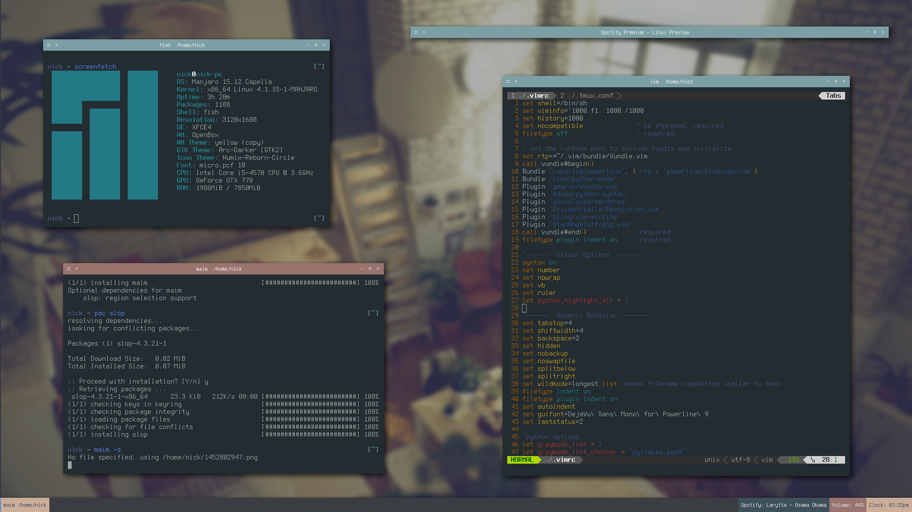

dotfiles
========

This repo is kind of a mess. I don't put much effort into it anymore

If you're using my lemon bar configs, you need to use this wrapper:
https://github.com/DelusionalLogic/bard

What my desktop looks right now as i'm typing this readme:

